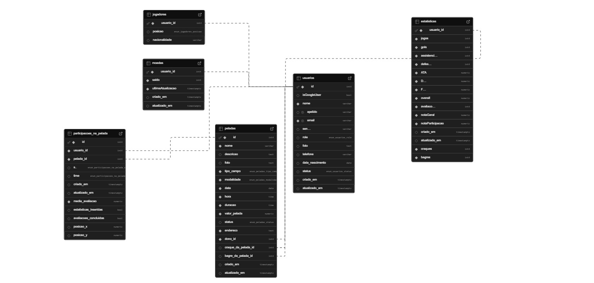

# Peladin

O PeladIn é uma plataforma dedicada à marcação de partidas de futebol amador, projetada para simplificar e otimizar o processo de organização de peladas entre amigos e grupos de jogadores. 
O objetivo é fornecer uma solução intuitiva e eficiente que permita aos usuários agendar jogos com facilidade, encontrar o local e horário mais adequados para as partidas e promover a integração social e a diversão através do esporte.

## 2. Arquitetura

### Estilo Arquitetural

- Estilo adotado: Monólitico, pelos beneficios da simplicidade, baixo custo, integração direta e deploy fácil

### Padrão Arquitetural

- Padrão adotado: MVC, pelos beneficios da organização, separação de responsabilidades e facilidade de integração com frontends React e Flutter

### Desenho Arquitetural

## 3. Identidade Visual

### Paleta de Cores

#### root
| Nome | Código HEX | Uso Principal |
|---|---:|---|
| --cor-bg-base | #ffffff | Background base (telas e cards) |
| --cor-bg-surface | #f5f5f5 | Surface / blocos de conteúdo |
| --cor-bg-surface-2 | #ebebeb | Surface alternativo |
| --cor-bg-input | #e6e6e6 | Fundo de inputs e campos |
| --cor-text-primary | #000000 | Texto primário |
| --cor-text-secondary | #333333 | Texto secundário |
| --cor-text-terciary | #4d4d4d | Texto terciário / labels |
| --cor-text-disabled | #777777 | Texto desabilitado / placeholder |
| --cor-text-invertido | #ffffff | Texto invertido (em fundos escuros) |
| --cor-accent | #44A642 | Cor de destaque / sucesso / primária |
| --cor-accent-strong | #2A7929 | Accent forte (estado ativo) |
| --cor-accent-hover | #256d25 | Accent — estado hover |
| --cor-accent-selected | #1f5c1f | Accent — item selecionado |
| --cor-accent-light | #6bcf6a | Accent claro / variação |
| --cor-accent-lighter | #a6e8a5 | Accent mais claro / hover suave |
| --cor-accent-bg | #d9f7d9 | Fundo para estados de sucesso (badges, chips) |
| --cinza-900 | #0f0f0f | Escala de cinza — 900 |
| --cinza-700 | #333333 | Escala de cinza — 700 |
| --cinza-500 | #777777 | Escala de cinza — 500 |
| --cinza-300 | #bfbfbf | Escala de cinza — 300 |
| --cinza-200 | #e6e6e6 | Escala de cinza — 200 |
| --cinza-100 | #f5f5f5 | Escala de cinza — 100 |
| --cor-borda | #cccccc | Cor padrão de bordas |
| --cor-borda-clara | #e0e0e0 | Cor de borda mais clara |

#### black mode
| Nome | Código HEX | Uso Principal |
|---|---:|---|
| --cor-bg-base (dark) | #000000 | Background base (modo escuro) |
| --cor-bg-surface (dark) | #101210 | Surface / blocos em dark |
| --cor-bg-surface-2 (dark) | #1A1A1A | Surface alternativo (dark) |
| --cor-bg-input (dark) | #333333 | Fundo de inputs (dark) |
| --cor-text-primary (dark) | #ffffff | Texto primário (dark) |
| --cor-text-secondary (dark) | #cccccc | Texto secundário (dark) |
| --cor-text-terciary (dark) | #aaaaaa | Texto terciário (dark) |
| --cor-text-disabled (dark) | #777777 | Texto desabilitado (dark) |
| --cor-text-invertido (dark) | #000000 | Texto invertido (para elementos claros) |
| --cor-accent-bg (dark) | #173217 | Fundo de accent em modo escuro |
| --cinza-900 (dark) | #000000 | Escala cinza 900 (dark) |
| --cinza-700 (dark) | #1f1f1f | Escala cinza 700 (dark) |
| --cinza-500 (dark) | #333333 | Escala cinza 500 (dark) |
| --cinza-300 (dark) | #666666 | Escala cinza 300 (dark) |
| --cinza-200 (dark) | #999999 | Escala cinza 200 (dark) |
| --cinza-100 (dark) | #cccccc | Escala cinza 100 (dark) |
| --cor-borda (dark) | #333333 | Cor de borda padrão (dark) |
| --cor-borda-clara (dark) | #444444 | Cor de borda clara (dark) |

### Tipografia

| Tipo | Fonte Principal | Peso | Uso |
|------|----------------|------|-----|
| Títulos | Poppins | Bold | Textos principais |
| Corpo | Poppins | SemiBold | Textos botoes e links|
| Auxiliar | Poppins | Regular | Textos secundarios, fonte dos inputs |

## 4. Componentes UI

### Botões

| Variante | Cor | Borda | Texto | Uso |
|---|---|---|---|---|
| green | #22C55E | #22C55E | Preto | Ação principal, ocupa toda a largura |
| white | #FFFFFF | #D1D5DB | Cinza escuro | Ação secundária ou neutra |
| outlined | TRANSPARENT | #FFFFFF | Branco | Ações em fundos escuros, efeito hover invertido |
| black | #000000 | #27272A | Branco | Botões menores ou de destaque dentro de cards |

---

### Inputs

| Propriedade | Valor |
|---|---|
| Altura | 2.5rem (aprox. 40px) |
| Bordas | 1px sólida, arredondada (md) |
| Placeholder | `" "` (usado para labels flutuantes) |
| Tipos suportados | text, password, number, email, etc. |

---

### Cards

| Propriedade | Valor |
|---|---|
| Fundo | `bg-surface` (#f5f5f5) |
| Borda | nenhuma / sombra leve (`shadow-md`) |
| Bordas arredondadas | `rounded-xl` |
| Espaçamento interno | `p-3` (12px) |

---

## 5. Ícones

| Ícone | Nome | Uso |
|---|---|---|
| UilMapMarker | Mapa / localização | Exibir endereço ou local da pelada |
| UilCalendarAlt | Calendário | Mostrar data da pelada |
| UilClock | Relógio | Mostrar horário da pelada |
| UilDollarSign | Cifrão | Botão de pagamento ou informações financeiras |
| UilAngleLeft / UilAngleRight | Setas | Navegação ou carrossel |
| UilTimes | X / Fechar | Fechar modal ou cancelar ação |
| UilExchange | Troca | Alternar ou trocar algo |
| UilUser | Usuário | Perfil, avatar ou participante |
| UilShuffle | Embaralhar | Misturar lista ou ordem |
| UilCheckCircle | Confirmar | Ações confirmadas ou sucesso |
| UilCamera | Câmera | Upload de foto |
| UilCheck | Check | Confirmação simples |
| UilFootball | Bola de futebol | Exibir esportes ou tipo de atividade |
| UilBars | Menu / hambúrguer | Abrir menu lateral |
| UilSignOutAlt | Sair | Logout / sair do sistema |
| UilTrophy | Troféu | Exibir premiações ou conquistas |

### 6. Jornadas do Usuário

#### Peladeiro
- Se cadastra
- Edita seu perfil
- Gerencia pelada
- Entra na pelada
- Visualiza calendario
- Separa times
- Cadastra estatisticas da pelada
- Avalia jogadores

## 7. Tecnologias

| Camada | Tecnologias / Bibliotecas | Observações |
|---|---|---|
| Frontend | React, Tailwind CSS e Flutter| React + Tailwind CSS para web e flutter para mobile, vite e postcss |
| Backend | Node.js, com bscript, cors e dotenv|  |
| Autenticação | JWT com OAuth2 | Proteções contra SQL Injection  |
| Comunicação entre serviços | RabbitMQ |  |

## 8. Banco de Dados — Estrutura (Tabelas)

A seguir, apresenta-se a estrutura do banco de dados utilizada no projeto. Cada tabela contém seus respectivos campos, tipos de dados, restrições e descrições, permitindo entender claramente como as informações são armazenadas e relacionadas.

As tabelas estão organizadas de acordo com as entidades do sistema, contemplando usuários, jogadores, estatísticas, peladas, participações e moedas.

### Tabela: usuarios

| Campo | Tipo | Restrições | Descrição |
|---|---|---|---|
| id | SERIAL | PRIMARY KEY | Identificador único do usuário. |
| isGoogleUser | BOOLEAN | NOT NULL | Indica se o usuário foi autenticado via Google. |
| nome | VARCHAR(100) | NOT NULL | Nome completo do usuário. |
| apelido | VARCHAR(50) | UNIQUE NOT NULL | Apelido usado na plataforma. |
| email | VARCHAR(120) | UNIQUE NOT NULL | Endereço de e-mail do usuário. |
| senha | VARCHAR(255) | NULL | Senha criptografada (nula para usuários do Google). |
| role | ENUM('JOGADOR', 'ADMIN') | DEFAULT 'JOGADOR' | Papel do usuário na plataforma. |
| foto | VARCHAR(255) | NULL | URL da foto de perfil do usuário. |
| telefone | VARCHAR(20) | NULL | Número de telefone do usuário. |
| data_nascimento | DATE | NULL | Data de nascimento do usuário. |
| status | ENUM('ATIVO', 'INATIVO', 'BANIDO') | DEFAULT 'ATIVO' | Situação atual do usuário. |
| criado_em | TIMESTAMP WITH TIME ZONE | DEFAULT CURRENT_TIMESTAMP | Data e hora de criação do registro. |
| atualizado_em | TIMESTAMP WITH TIME ZONE | DEFAULT CURRENT_TIMESTAMP | Data e hora da última atualização do registro. |

### Tabela: jogadores

| Campo | Tipo | Restrições | Descrição |
|---|---|---|---|
| usuario_id | INT | PRIMARY KEY, FOREIGN KEY (usuario_id) REFERENCES usuarios(id) | Identificador do usuário. |
| posicao | ENUM('GOLEIRO', 'ZAGUEIRO', 'LATERAL', 'ALA', 'VOLANTE', 'MEIO_CAMPO', 'PONTA', 'ATACANTE') | NULL | Posição em que o jogador atua. |
| nacionalidade | ENUM('BRASILEIRO', 'ARGENTINO', 'CHILENO', 'URUGUAIO', 'PARAGUAIO', 'OUTRO') | NULL | Nacionalidade do jogador. |

### Tabela: estatisticas

| Campo | Tipo | Restrições | Descrição |
|---|---|---|---|
| usuario_id | INTEGER | NOT NULL, FK usuários | ID do usuário |
| jogos | INTEGER | NOT NULL DEFAULT 0 | Número de jogos disputados |
| gols | INTEGER | NOT NULL DEFAULT 0 | Total de gols |
| assistencias | INTEGER | NOT NULL DEFAULT 0 | Total de assistências |
| defesas | INTEGER | NOT NULL DEFAULT 0 | Total de defesas |
| ATA | DECIMAL | NOT NULL DEFAULT 40.0 & < 100 | Atributo ofensivo do jogador |
| DEF | DECIMAL | NOT NULL DEFAULT 40.0 & < 100 | Atributo defensivo do jogador |
| FOR | DECIMAL | NOT NULL DEFAULT 40.0 & < 100| Atributo físico do jogador |
| overall | DECIMAL | NOT NULL DEFAULT 40.0 & < 100 | Avaliação geral do jogador |
| avaliacoes | INTEGER | NOT NULL DEFAULT 0 | Número de avaliações recebidas |
| notaGeral | DECIMAL | NOT NULL DEFAULT 0.0, < 10 | Nota geral do jogador |
| notaParticipacao | DECIMAL | NOT NULL DEFAULT 0.0, < 10 | Nota de participação |
| criado_em | TIMESTAMP | NOT NULL | Data de criação do registro |
| atualizado_em | TIMESTAMP | NOT NULL | Data da última atualização |
| craques | INTEGER | NOT NULL DEFAULT 0 | Número de vezes eleito craque |
| bagres | INTEGER | NOT NULL DEFAULT 0 | Número de vezes eleito bagre |

### Tabela: peladas

| Campo | Tipo | Restrições | Descrição |
|---|---|---|---|
| id | INT | PRIMARY KEY, AUTO_INCREMENT | Identificador único da pelada. |
| nome | VARCHAR(100) | NOT NULL | Nome da pelada. |
| descricao | TEXT | - | Descrição detalhada sobre a pelada. |
| foto | VARCHAR(255) | - | imagem convertida em BASE 64 representando a pelada. |
| tipo_campo | ENUM('futsal', 'society', 'campo') | NOT NULL | Tipo de campo onde a pelada será jogada. |
| modalidade | ENUM('3x3, '4x4', '5x5', '6x6', '7x7', '8x8', '9x9', '10x10', '11x11') | NOT NULL | Modalidade da pelada. |
| data | DATE | NOT NULL | Data em que a pelada ocorrerá. |
| hora | TIME | NOT NULL | Horário de início da pelada. |
| duracao | INT | NOT NULL | Duração da pelada em minutos. |
| valor_pelada | DECIMAL(10,2) | DEFAULT 0.00 | Valor de participação na pelada. |
| status | ENUM('AGENDADA', 'CONFIRMADA', 'EM_ANDAMENTO', 'AGUARDANDO_AVALIACAO', 'FINALIZADA, CANCELADA') | DEFAULT 'AGENDADA' | Estado atual da pelada. |
| endereco | VARCHAR(255) | NOT NULL | Endereço completo do local da pelada. |
| dono_id | INT | NOT NULL, FOREIGN KEY (dono_id) REFERENCES usuarios(id) | ID do usuário que criou a pelada. |
| craque_da_pelada_id | INT | NULL, FOREIGN KEY (craque_da_pelada_id) REFERENCES usuarios(id) | ID do jogador eleito craque da pelada. |
| bagre_da_pelada_id | INT | NULL, FOREIGN KEY (bagre_da_pelada_id) REFERENCES usuarios(id) | ID do jogador eleito bagre da pelada. |
| criado_em | DATETIME | DEFAULT CURRENT_TIMESTAMP | Data e hora de criação do registro. |
| atualizado_em | DATETIME | DEFAULT CURRENT_TIMESTAMP ON UPDATE CURRENT_TIMESTAMP | Data e hora da última atualização do registro. |

### Tabela: participacoes_na_pelada

| Campo | Tipo | Restrições | Descrição |
|---|---|---|---|
| id | SERIAL | PRIMARY KEY | Identificador único da participação. |
| usuario_id | INT | NOT NULL, FOREIGN KEY (usuario_id) REFERENCES usuarios(id) | Identificador do usuário participante. |
| pelada_id | INT | NOT NULL, FOREIGN KEY (pelada_id) REFERENCES peladas(id) | Identificador da pelada associada. |
| status | ENUM('CONFIRMADO', 'PENDENTE', 'CANCELADO', 'CONVIDADO') | DEFAULT 'PENDENTE' | Situação da participação do jogador na pelada. |
| time | CHAR(1) | NULL | Time ao qual o jogador pertence (ex: 'A', 'B'). |
| criado_em | TIMESTAMP WITH TIME ZONE | DEFAULT CURRENT_TIMESTAMP | Data e hora de criação do registro. |
| atualizado_em | TIMESTAMP WITH TIME ZONE | DEFAULT CURRENT_TIMESTAMP ON UPDATE CURRENT_TIMESTAMP | Data e hora da última atualização. |
| media_avaliacao | DECIMAL(3,1) | DEFAULT 0.0 & < 100 | Média de avaliação do jogador na pelada. |
| estatisticas_inseridas | BOOLEAN | DEFAULT FALSE | Indica se as estatísticas do jogador já foram inseridas. |
| avaliacoes_concluidas | BOOLEAN | DEFAULT FALSE | Indica se o jogador concluiu suas avaliações. |
| posicao_x | DECIMAL(5,2) | NULL | Coordenada X do jogador no campo (para visualização tática). |
| posicao_y | DECIMAL(5,2) | NULL | Coordenada Y do jogador no campo (para visualização tática). |

### Tabela: moedas

| Campo | Tipo | Restrições | Descrição |
|---|---|---|---|
| usuario_id | INT | PRIMARY KEY, FOREIGN KEY (usuario_id) REFERENCES usuarios(id) | Identificador do usuário dono das moedas. |
| saldo | DECIMAL(10,2) | DEFAULT 0.00, NOT NULL | Quantidade atual de moedas do usuário. |
| ultimaAtualizacao | TIMESTAMP WITH TIME ZONE | NOT NULL | Data e hora da última alteração de saldo. |
| criado_em | TIMESTAMP WITH TIME ZONE | DEFAULT CURRENT_TIMESTAMP | Data e hora de criação do registro. |
| atualizado_em | TIMESTAMP WITH TIME ZONE | DEFAULT CURRENT_TIMESTAMP ON UPDATE CURRENT_TIMESTAMP | Data e hora da última atualização do registro. |

## 9. Restrições Arquiteturais

As restrições impostas ao projeto que afetam sua arquitetura são:

- O sistema deve utilizar um modelo baseado em Web Service para comunicação e disponibilização de funcionalidades.
- O sistema deve prover serviços tanto para ambiente web quanto para dispositivos móveis.
- O front-end deve ser implementado com tecnologias móveis e/ou híbridas que suportem multiplataforma.
- O sistema deve incorporar middlewares e tecnologias associadas para processamento de mensagens em tempo real.
- O sistema deve permitir que múltiplos clientes se conectem simultaneamente a um único servidor, realizando operações concorrentes.
- O sistema deve tratar erros de comunicação, indisponibilidade do servidor, timeouts, entre outros, utilizando reenvio de mensagens.
- O sistema deve possuir estratégias e implementações para testes.
- O sistema deve utilizar serviços em nuvem para hospedagem e/ou recursos.
- O sistema web deve ser hospedado em uma plataforma de nuvem gratuita.

#### Mecanismos Arquiteturais

Os mecanismos arquiteturais adotados neste projeto são:

| **Análise** | **Design** | **Implementação** |
| --- | --- | --- |
| Persistência | Banco de dados relacional | PostgreSQL + Sequelize |
| Front end | SPA | ReactJS |
| Back end | Rest API | NodeJS + Express |
| Aplicativo | Tecnologia Android e IOS | Flutter |
| Integração | Event driven | RabbitMQ |
| Log do sistema | | Winston |
| Teste de Software | Testes unitários | Jest |
| Deploy | Cloud | Render |

## 10. Governança do Design System

### Responsáveis

- **Squad de Design System**: formado por representantes de design, frontend e arquitetura.
- **Designers e Desenvolvedores de cada squad**: responsáveis por propor novos componentes e colaborar com manutenções.

### Processo de Atualização

1. **Proposição**: novos componentes ou alterações são sugeridos via Pull Request em repositório dedicado.
2. **Revisão**: a equipe de governança avalia a aderência às diretrizes de acessibilidade, responsividade, padronização e reuso.
3. **Documentação**: cada alteração aceita deve ser documentada no github projects do projeto.

### Boas Práticas

- Nomeação clara e consistente de componentes.
- Testes automatizados para todos os componentes (visuais e unitários).
- Revisões quinzenais do sistema para identificar componentes obsoletos ou duplicados.
- Alinhamento com tokens de design centralizados.

### Ciclo de Revisão

- **Mensal**: revisão geral da biblioteca para garantir consistência.
- **Semestral**: atualização de tokens de identidade visual, quando necessário.
- **Sob demanda**: atualização de componentes com base em feedbacks das equipes ou necessidade de novos fluxos.

## 11. Links Úteis

| Recurso | URL | Observações |
|---|---|---|
| Figma (Identidade visual) | https://www.figma.com/design/AlK5OFJgyJJNIAY8Pa7G01/PeladIn--Copy-?node-id=0-1&t=qId81isUUFgxN6Dv-1  |  |
