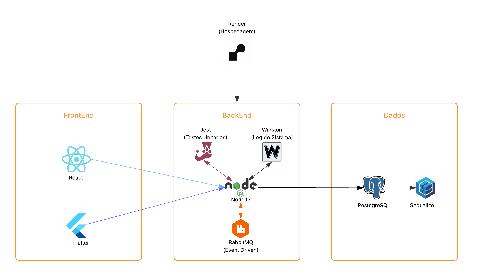

# Design System — Template

Preencha as seções e tabelas abaixo com as informações do seu projeto.

## 1. Visão Geral

- **Nome do projeto**: PeladIn
- **Descrição curta**: O PeladIn é uma plataforma dedicada à marcação de partidas de futebol amador, projetada para simplificar e otimizar o processo de organização de peladas entre amigos e grupos de jogadores. 
- **Objetivo**: O objetivo é fornecer uma solução intuitiva e eficiente que permita aos usuários agendar jogos com facilidade, encontrar o local e horário mais adequados para as partidas e promover a integração social e a diversão através do esporte.

## 2. Arquitetura

### Estilo Arquitetural

- Estilo adotado: Monólito

### Padrão Arquitetural

- Padrão adotado: MVC

### Desenho Arquitetural

## 3. Identidade Visual

### Paleta de Cores

#### root
| Nome | Código HEX | Uso Principal |
|---|---:|---|
| --cor-bg-base | #ffffff | Background base (telas e cards) |
| --cor-bg-surface | #f5f5f5 | Surface / blocos de conteúdo |
| --cor-bg-surface-2 | #ebebeb | Surface alternativo |
| --cor-bg-input | #e6e6e6 | Fundo de inputs e campos |
| --cor-text-primary | #000000 | Texto primário |
| --cor-text-secondary | #333333 | Texto secundário |
| --cor-text-terciary | #4d4d4d | Texto terciário / labels |
| --cor-text-disabled | #777777 | Texto desabilitado / placeholder |
| --cor-text-invertido | #ffffff | Texto invertido (em fundos escuros) |
| --cor-accent | #44A642 | Cor de destaque / sucesso / primária |
| --cor-accent-strong | #2A7929 | Accent forte (estado ativo) |
| --cor-accent-hover | #256d25 | Accent — estado hover |
| --cor-accent-selected | #1f5c1f | Accent — item selecionado |
| --cor-accent-light | #6bcf6a | Accent claro / variação |
| --cor-accent-lighter | #a6e8a5 | Accent mais claro / hover suave |
| --cor-accent-bg | #d9f7d9 | Fundo para estados de sucesso (badges, chips) |
| --cinza-900 | #0f0f0f | Escala de cinza — 900 |
| --cinza-700 | #333333 | Escala de cinza — 700 |
| --cinza-500 | #777777 | Escala de cinza — 500 |
| --cinza-300 | #bfbfbf | Escala de cinza — 300 |
| --cinza-200 | #e6e6e6 | Escala de cinza — 200 |
| --cinza-100 | #f5f5f5 | Escala de cinza — 100 |
| --cor-borda | #cccccc | Cor padrão de bordas |
| --cor-borda-clara | #e0e0e0 | Cor de borda mais clara |

#### black mode
| Nome | Código HEX | Uso Principal |
|---|---:|---|
| --cor-bg-base (dark) | #000000 | Background base (modo escuro) |
| --cor-bg-surface (dark) | #101210 | Surface / blocos em dark |
| --cor-bg-surface-2 (dark) | #1A1A1A | Surface alternativo (dark) |
| --cor-bg-input (dark) | #333333 | Fundo de inputs (dark) |
| --cor-text-primary (dark) | #ffffff | Texto primário (dark) |
| --cor-text-secondary (dark) | #cccccc | Texto secundário (dark) |
| --cor-text-terciary (dark) | #aaaaaa | Texto terciário (dark) |
| --cor-text-disabled (dark) | #777777 | Texto desabilitado (dark) |
| --cor-text-invertido (dark) | #000000 | Texto invertido (para elementos claros) |
| --cor-accent-bg (dark) | #173217 | Fundo de accent em modo escuro |
| --cinza-900 (dark) | #000000 | Escala cinza 900 (dark) |
| --cinza-700 (dark) | #1f1f1f | Escala cinza 700 (dark) |
| --cinza-500 (dark) | #333333 | Escala cinza 500 (dark) |
| --cinza-300 (dark) | #666666 | Escala cinza 300 (dark) |
| --cinza-200 (dark) | #999999 | Escala cinza 200 (dark) |
| --cinza-100 (dark) | #cccccc | Escala cinza 100 (dark) |
| --cor-borda (dark) | #333333 | Cor de borda padrão (dark) |
| --cor-borda-clara (dark) | #444444 | Cor de borda clara (dark) |

### Tipografia

| Tipo | Fonte Principal | Peso | Uso |
|------|----------------|------|-----|
| Títulos | Poppins | Bold | Textos principais |
| Corpo | Poppins | SemiBold | Textos botoes e links|
| Auxiliar | Poppins | Regular | Textos secundarios, fonte dos inputs |

## 4. Componentes UI

### Botões

| Variante | Cor | Borda | Texto | Uso |
|---|---:|---:|---|---|
|  |  |  |  |  |

### Inputs

| Propriedade | Valor |
|---|---|
| Altura |  |
| Bordas |  |
| Placeholder |  |
| Tipos suportados |  |

### Cards

| Propriedade | Valor |
|---|---|
| Fundo |  |
| Borda |  |
| Bordas arredondadas |  |
| Espaçamento interno |  |

## 5. Ícones

| Ícone | Nome | Uso |
|---|---|---|
|  |  |  |

### 6. Jornadas do Usuário

#### Peladeiro
- Se cadastra
- Edita seu perfil
- Gerencia pelada
- Entra na pelada
- Visualiza calendario
- Separa times
- Cadastra estatisticas da pelada
- Avalia jogadores

## 7. Tecnologias

| Camada | Tecnologias / Bibliotecas | Observações |
|---|---|---|
| Frontend | React, Tailwind CSS e Flutter| React + Tailwind CSS para web e flutter para mobile, vite e postcss |
| Backend | Node.js, com bscript, cors e dotenv|  |
| Autenticação | JWT com OAuth2 | Proteções contra SQL Injectio  |
| Comunicação entre serviços | RabbitMQ |  |

## 8. Banco de Dados — Estrutura (Tabelas)

Preencha cada tabela de acordo com o esquema do seu projeto.

### Tabela: Usuarios

| Campo | Tipo | Restrições | Descrição |
|---|---|---|---|
|  |  |  |  |

### Tabela: Pacientes

| Campo | Tipo | Restrições | Descrição |
|---|---|---|---|
|  |  |  |  |

### Tabela: Medicos

| Campo | Tipo | Restrições | Descrição |
|---|---|---|---|
|  |  |  |  |

### Tabela: Administradores

| Campo | Tipo | Restrições | Descrição |
|---|---|---|---|
|  |  |  |  |

### Tabela: Consultas

| Campo | Tipo | Restrições | Descrição |
|---|---|---|---|
|  |  |  |  |

### Tabela: Especialidades

| Campo | Tipo | Restrições | Descrição |
|---|---|---|---|
|  |  |  |  |

## 9. Requisitos de Segurança

| Requisito | Detalhes |
|---|---|
|  |  |

## 10. Governança do Design System

### Responsáveis

| Papel | Nome | Responsabilidades |
|---|---|---|
|  |  |  |

### Processo de Atualização

| Etapa | Descrição | Responsável | Frequência |
|---|---|---:|---|
|  |  |  |  |

### Boas Práticas

- Nomeação de componentes:
- Testes automatizados:
- Revisões e manutenção:

### Ciclo de Revisão

| Período | Ação |
|---|---|
| Mensal |  |
| Semestral |  |
| Sob demanda |  |

## 11. Links Úteis

| Recurso | URL | Observações |
|---|---|---|
| Figma (Identidade visual) | https://www.figma.com/design/AlK5OFJgyJJNIAY8Pa7G01/PeladIn--Copy-?node-id=0-1&t=qId81isUUFgxN6Dv-1  |  |

---

Preencha as linhas vazias das tabelas e campos de texto com as informações do seu projeto.

---

## COMPONENTES ESSENCIAIS

1. **Monolito**  
2. **Arquitetura em camadas com MVC**  
3. **REST, com RabbitMQ**  
4. **SQL, caching para consultas**  
5. **Horizontal, com load balancing**  
6. **Autenticação JWT com OAuth2, proteções contra SQL Injection**  
7. **HealthCheck, logs estruturados**
